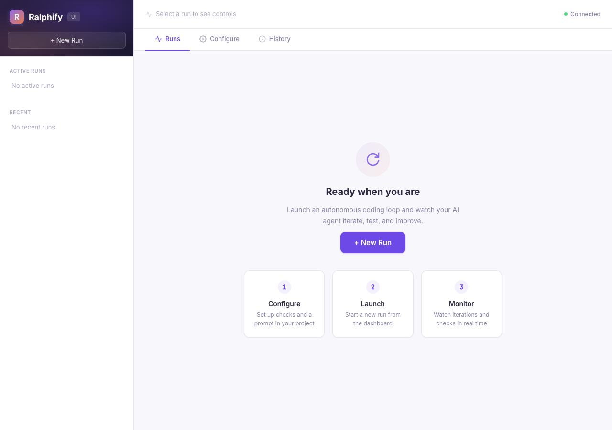
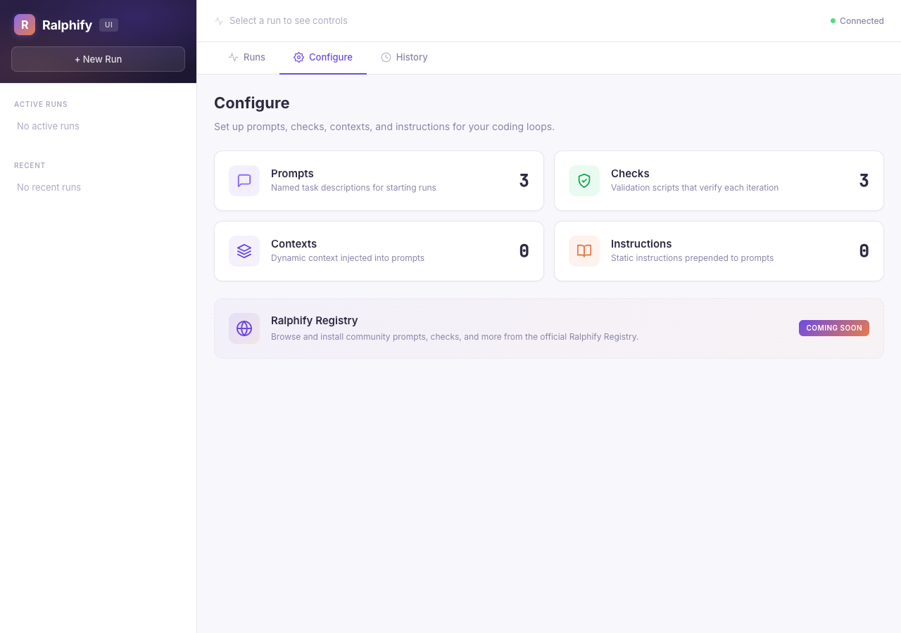
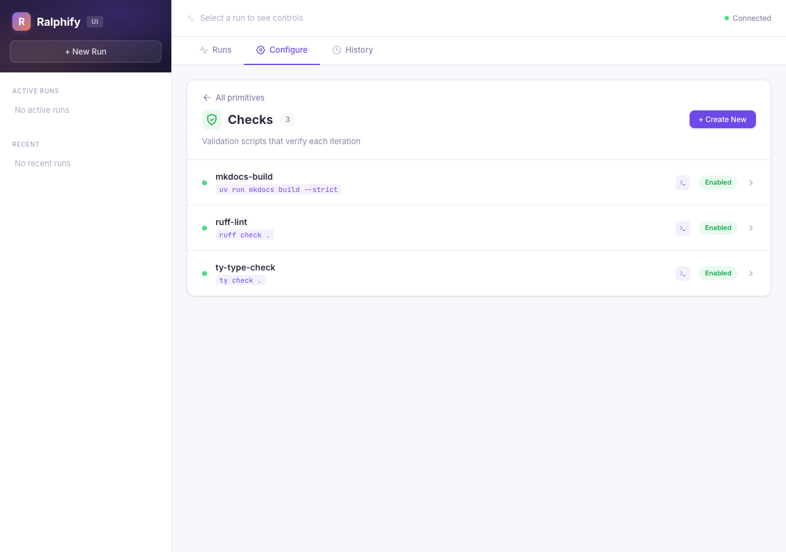
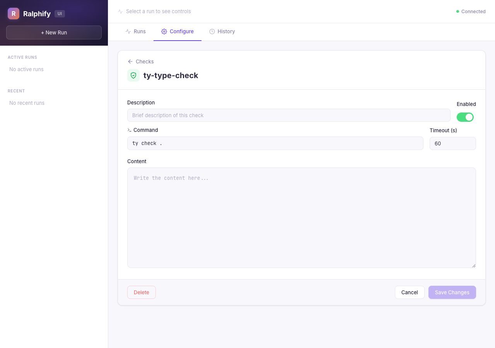
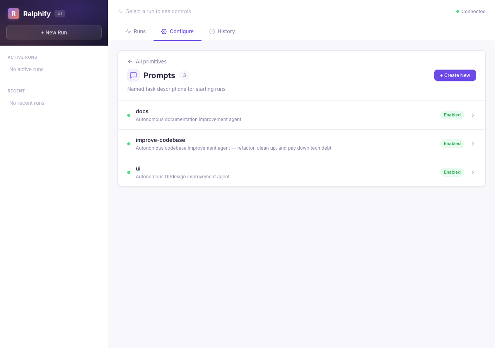
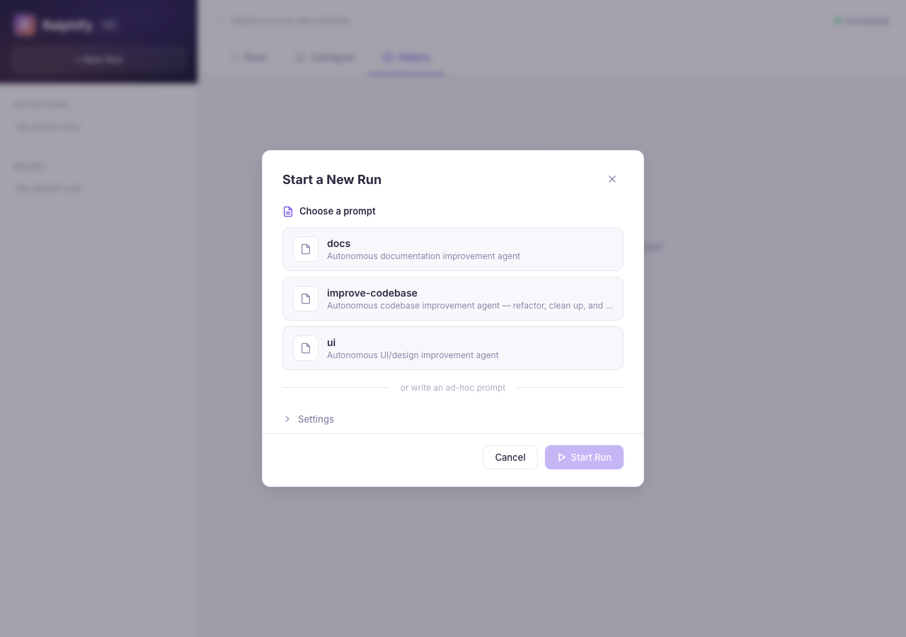
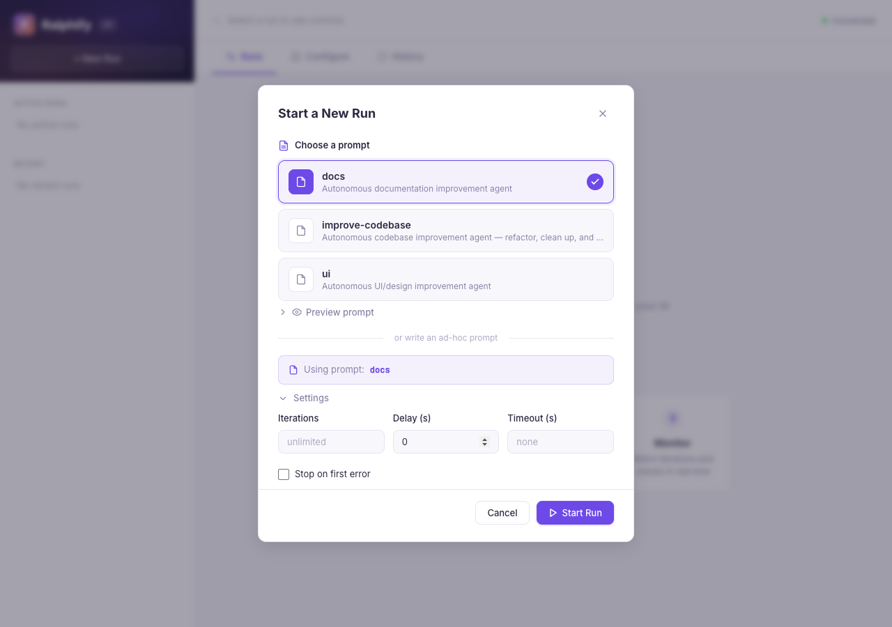
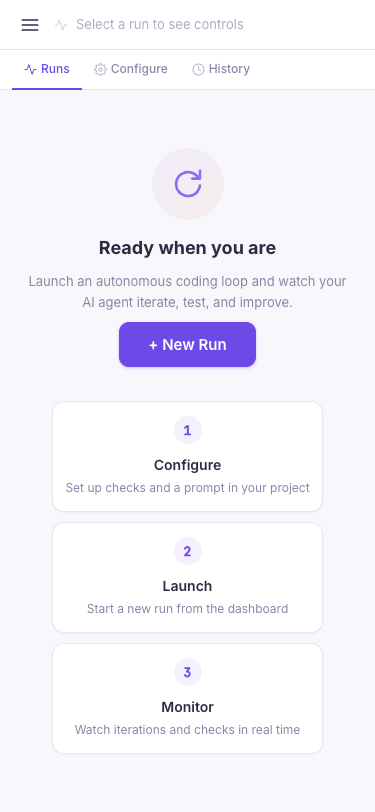

# Web Dashboard

Ralphify includes a web-based orchestration dashboard that lets you manage
multiple runs, watch iterations in real time, and edit primitives — all from
your browser.

## Install

The dashboard requires optional dependencies:

=== "uv tool (recommended)"

    If you installed ralphify with `uv tool install`, reinstall with the UI extra:

    ```bash
    uv tool install "ralphify[ui]"
    ```

=== "pipx"

    ```bash
    pipx install "ralphify[ui]"
    ```

=== "pip"

    ```bash
    pip install "ralphify[ui]"
    ```

This adds FastAPI, uvicorn, and WebSocket support.

## Launch

```bash
ralph ui
```

The dashboard opens at [http://127.0.0.1:8765](http://127.0.0.1:8765).

<figure markdown="span">
  { loading=lazy }
  <figcaption>The Runs tab is your starting point for launching and monitoring autonomous loops.</figcaption>
</figure>

| Option    | Default       | Description              |
|-----------|---------------|--------------------------|
| `--port`  | `8765`        | Port to serve the UI on  |
| `--host`  | `127.0.0.1`   | Host to bind to          |

To expose the dashboard on your network:

```bash
ralph ui --host 0.0.0.0 --port 9000
```

## Dashboard tabs

The dashboard has three tabs: **Runs**, **Configure**, and **History**.

### Runs

The Runs tab is the default landing page. When no runs are active, it shows an
onboarding view with three steps — Configure, Launch, Monitor — and a prominent
**+ New Run** button to get you started.

Once a run is active, select it in the sidebar to see its iterations as they
complete:

- Pass/fail status with color-coded badges
- Agent output (truncated to 5,000 characters, same as the CLI)
- Check results with individual pass/fail/timeout indicators
- Duration and return codes

Each check gets a **sparkline bar** showing its pass/fail history across
iterations. Green means pass, red means fail, yellow means timeout — useful for
spotting flaky checks or regressions at a glance.

Events stream over WebSocket, so the page updates without refreshing.

### Configure

The Configure tab is your central hub for managing all primitives. The overview
shows four cards — **Prompts**, **Checks**, **Contexts**, and **Instructions** —
each displaying how many items exist.

<figure markdown="span">
  { loading=lazy }
  <figcaption>The Configure overview shows all four primitive types with counts. Click any card to drill in.</figcaption>
</figure>

Click into any primitive type to see its items. Each list shows the name,
command (for checks and contexts), and enabled status:

<figure markdown="span">
  { loading=lazy }
  <figcaption>Drill into Checks to see each check's command and enabled status.</figcaption>
</figure>

Click an item to open its editor, where you can:

- Edit the **description**, **command**, and **timeout** fields
- Toggle the **enabled** switch
- Edit the **content** (failure instructions for checks, static content for contexts)
- **Delete** the primitive entirely
- **Create new** primitives with the button at the top of each list

<figure markdown="span">
  { loading=lazy }
  <figcaption>Click a check to edit its command, timeout, failure instruction, and enabled toggle.</figcaption>
</figure>

The Prompts section works the same way — browse, create, edit, and delete named
prompts without leaving the browser:

<figure markdown="span">
  { loading=lazy }
  <figcaption>Drill into Prompts to browse and manage your named prompts.</figcaption>
</figure>

Changes are written directly to the `.ralph/` directory on disk.

### History

The History tab shows all past runs — completed, stopped, and failed. Each run
displays its pass rate, iteration count, and status badge. Click any run to
review its full iteration details, including individual check results and agent
output for every iteration.

When no runs have completed yet, the tab shows an onboarding prompt with a
button to start your first run.

<figure markdown="span">
  { loading=lazy }
  <figcaption>The History tab lists all past runs with pass rates and status badges. Click any run to drill into its iterations.</figcaption>
</figure>

## Starting a run

Click **New Run** in the sidebar to open the run modal. It lets you:

- **Pick a named prompt** — cards show every prompt discovered in `.ralph/prompts/`
- **Preview the prompt** — after selecting a prompt, expand the preview panel to see its full content before launching
- **Enter an ad-hoc prompt** — toggle to ad-hoc mode and type a one-off task
- **Configure settings** — expand the settings panel to set max iterations, delay between iterations, timeout, and stop-on-error

<figure markdown="span">
  { loading=lazy }
  <figcaption>Pick a named prompt or write an ad-hoc one. The Settings panel is collapsed by default.</figcaption>
</figure>

<figure markdown="span">
  { loading=lazy }
  <figcaption>Select a prompt and expand Settings to configure iterations, delay, timeout, and stop-on-error before launching.</figcaption>
</figure>

Once a run starts, you can **pause**, **resume**, or **stop** it from the
sidebar or the controls bar above the iteration view on the Runs tab.

## Editing while a run is active

The dashboard lets you edit primitives via the Configure tab while a run is in progress, but not all changes take effect immediately:

| What you change | When it takes effect |
|---|---|
| `PROMPT.md` content | Next iteration — the prompt is re-read from disk every iteration |
| Context command output | Next iteration — context commands re-run every iteration |
| Check/context/instruction config (frontmatter, body, enable/disable) | After restart — primitive configurations are loaded once when a run starts |
| New or deleted primitives | After restart — primitive discovery happens once at run start |

To apply primitive configuration changes to a running run, **stop** the run and **start a new one**. The new run will discover the updated primitives from disk.

!!! tip "Prompt edits are always live"
    The most common adjustment — adding a constraint or changing the task in your prompt — takes effect on the very next iteration without restarting. This is the primary way to steer the agent in real time.

## Architecture

The dashboard is a single-page app that talks to a FastAPI backend:

```
Browser (Preact + htm)
  ↕ WebSocket (live events)
  ↕ REST API (run management, primitives)
FastAPI (uvicorn)
  ↕ RunManager (threading)
  ↕ run_loop (engine.py)
```

- **Backend**: FastAPI serves the REST API and WebSocket endpoint. Each run
  executes in its own thread using the same `run_loop()` that powers the CLI.
- **Frontend**: A Preact app bundled with esbuild. No build step needed to use
  it — the compiled bundle ships with the package.
- **Events**: The run loop emits structured events (iteration started, check
  passed, check failed, etc.) into a queue. An async task drains the queue and
  broadcasts events to all connected WebSocket clients.

## Responsive layout

The dashboard adapts to smaller screens. On tablets and phones (below 900px
wide), the sidebar collapses into a slide-out drawer — tap the hamburger menu to
open it and the overlay to close it. Controls and spacing tighten further below
600px so the dashboard remains usable on a phone.

<figure markdown="span">
  { width="360" loading=lazy }
  <figcaption>On phones, the sidebar collapses and the layout stacks vertically.</figcaption>
</figure>

## REST API

The dashboard exposes a REST API you can use to script runs, manage primitives,
and build custom integrations. All examples below assume the dashboard is running
at `http://127.0.0.1:8765`.

### Runs

#### Start a new run

```bash
curl -X POST http://127.0.0.1:8765/api/runs \
  -H "Content-Type: application/json" \
  -d '{
    "project_dir": ".",
    "max_iterations": 5,
    "delay": 2,
    "timeout": 300,
    "stop_on_error": true
  }'
```

The request body accepts these fields:

| Field            | Type          | Default      | Description                                         |
|------------------|---------------|--------------|-----------------------------------------------------|
| `project_dir`    | string        | `"."`        | Path to the project directory                       |
| `prompt_file`    | string        | `"PROMPT.md"`| Path to the prompt file                             |
| `prompt_text`    | string\|null  | `null`       | Inline prompt text (overrides `prompt_file`)        |
| `prompt_name`    | string\|null  | `null`       | Named prompt to use from `.ralph/prompts/`          |
| `command`        | string\|null  | `null`       | Agent command (reads from `ralph.toml` if omitted)  |
| `args`           | list\|null    | `null`       | Agent arguments (reads from `ralph.toml` if omitted)|
| `max_iterations` | int\|null     | `null`       | Max iterations (`null` = unlimited)                 |
| `delay`          | float         | `0`          | Seconds to wait between iterations                  |
| `timeout`        | float\|null   | `null`       | Seconds before killing a stuck iteration            |
| `stop_on_error`  | bool          | `false`      | Stop the loop if the agent exits non-zero           |
| `log_dir`        | string\|null  | `null`       | Directory to save iteration logs                    |

Response:

```json
{
  "run_id": "a1b2c3d4",
  "status": "running",
  "iteration": 0,
  "completed": 0,
  "failed": 0,
  "timed_out": 0
}
```

You can provide a prompt three ways — pick one:

- **`prompt_file`** — path to a markdown file (default: reads `PROMPT.md`)
- **`prompt_text`** — raw prompt string passed inline
- **`prompt_name`** — name of a prompt in `.ralph/prompts/`

#### List all runs

```bash
curl http://127.0.0.1:8765/api/runs
```

```json
[
  {
    "run_id": "a1b2c3d4",
    "status": "running",
    "iteration": 3,
    "completed": 2,
    "failed": 1,
    "timed_out": 0
  }
]
```

#### Get run details

```bash
curl http://127.0.0.1:8765/api/runs/a1b2c3d4
```

Returns the same shape as the list response, for a single run.

#### Pause, resume, and stop

```bash
curl -X POST http://127.0.0.1:8765/api/runs/a1b2c3d4/pause
curl -X POST http://127.0.0.1:8765/api/runs/a1b2c3d4/resume
curl -X POST http://127.0.0.1:8765/api/runs/a1b2c3d4/stop
```

All three return the updated run status.

#### Update settings mid-run

Change runtime settings without restarting:

```bash
curl -X PATCH http://127.0.0.1:8765/api/runs/a1b2c3d4/settings \
  -H "Content-Type: application/json" \
  -d '{"max_iterations": 10, "delay": 5}'
```

All fields are optional — only the ones you include are updated:

| Field            | Type         | Description                           |
|------------------|--------------|---------------------------------------|
| `max_iterations` | int\|null    | New iteration limit                   |
| `delay`          | float\|null  | New delay between iterations          |
| `timeout`        | float\|null  | New timeout per iteration             |
| `stop_on_error`  | bool\|null   | Whether to stop on agent errors       |

### Primitives

Primitive endpoints use a base64-encoded `project_dir` in the URL path. Encode
it with:

```bash
PROJECT=$(echo -n "/path/to/project" | base64)
```

#### List all primitives

```bash
curl http://127.0.0.1:8765/api/projects/$PROJECT/primitives
```

```json
[
  {
    "kind": "checks",
    "name": "tests",
    "enabled": true,
    "content": "Fix all failing tests.",
    "frontmatter": {"command": "uv run pytest -x", "timeout": 120, "enabled": true}
  },
  {
    "kind": "contexts",
    "name": "git-log",
    "enabled": true,
    "content": "## Recent commits",
    "frontmatter": {"command": "git log --oneline -10", "timeout": 10, "enabled": true}
  }
]
```

#### Get a specific primitive

```bash
curl http://127.0.0.1:8765/api/projects/$PROJECT/primitives/checks/tests
```

#### Create a new primitive

```bash
curl -X POST http://127.0.0.1:8765/api/projects/$PROJECT/primitives/checks \
  -H "Content-Type: application/json" \
  -d '{
    "content": "Fix all type errors.",
    "frontmatter": {
      "name": "typecheck",
      "command": "uv run mypy src/",
      "timeout": 60,
      "enabled": true
    }
  }'
```

The `name` field in `frontmatter` is required — it determines the directory name
under `.ralph/checks/typecheck/CHECK.md`.

#### Update a primitive

```bash
curl -X PUT http://127.0.0.1:8765/api/projects/$PROJECT/primitives/checks/tests \
  -H "Content-Type: application/json" \
  -d '{
    "content": "Fix all failing tests. Do not skip or delete tests.",
    "frontmatter": {"command": "uv run pytest -x", "timeout": 180, "enabled": true}
  }'
```

#### Delete a primitive

```bash
curl -X DELETE http://127.0.0.1:8765/api/projects/$PROJECT/primitives/checks/typecheck
```

Returns `204 No Content` on success.

#### Test a check

Run a single check immediately and get the result — useful for validating a
check command before starting a full run.

```bash
curl -X POST http://127.0.0.1:8765/api/projects/$PROJECT/primitives/checks/tests/test
```

```json
{
  "passed": true,
  "exit_code": 0,
  "output": "4 passed in 1.23s\n",
  "timed_out": false,
  "duration": 1.45
}
```

Returns `404` if the check does not exist.

### WebSocket

Connect to `/api/ws` for live event streaming:

```javascript
const ws = new WebSocket("ws://127.0.0.1:8765/api/ws");

ws.onmessage = (event) => {
  const data = JSON.parse(event.data);
  console.log(data.type, data.run_id, data.data);
};
```

Events are JSON objects with this shape:

```json
{
  "type": "iteration_started",
  "run_id": "a1b2c3d4",
  "timestamp": "2026-03-11T14:23:01.123456",
  "data": { "iteration": 1 }
}
```

You can filter events by run ID:

```javascript
ws.send(JSON.stringify({ "action": "subscribe", "run_id": "a1b2c3d4" }));
```

Send `{"action": "subscribe", "run_id": "*"}` to receive events from all runs
(this is the default on connect).

To unsubscribe from a specific run:

```javascript
ws.send(JSON.stringify({ "action": "unsubscribe", "run_id": "a1b2c3d4" }));
```

#### Event types

Every event has `type`, `run_id`, `timestamp`, and `data`. The table below lists all event types and their `data` fields.

**Run lifecycle**

| Event type | When | Data fields |
|---|---|---|
| `run_started` | Run begins | `checks`, `contexts`, `instructions` (int counts), `max_iterations`, `timeout`, `delay`, `prompt_name` |
| `run_stopped` | Run ends for any reason | `reason` (`"completed"`, `"user_requested"`, `"error"`), `total`, `completed`, `failed`, `timed_out` |
| `run_paused` | Run is paused | — |
| `run_resumed` | Run is resumed | — |

**Iteration lifecycle**

| Event type | When | Data fields |
|---|---|---|
| `iteration_started` | Iteration begins | `iteration` |
| `iteration_completed` | Agent exits with code 0 | `iteration`, `returncode`, `duration` (seconds), `duration_formatted`, `detail`, `log_file` |
| `iteration_failed` | Agent exits non-zero | `iteration`, `returncode`, `duration`, `duration_formatted`, `detail`, `log_file` |
| `iteration_timed_out` | Agent exceeds timeout | `iteration`, `returncode` (null), `duration`, `duration_formatted`, `detail`, `log_file` |

**Checks**

| Event type | When | Data fields |
|---|---|---|
| `checks_started` | Check phase begins | `iteration`, `count` |
| `check_passed` | A single check passes | `iteration`, `name`, `passed`, `exit_code`, `timed_out` |
| `check_failed` | A single check fails | `iteration`, `name`, `passed`, `exit_code`, `timed_out` |
| `checks_completed` | All checks finish | `iteration`, `passed`, `failed`, `results` (array of `{name, passed, exit_code, timed_out}`) |

**Prompt assembly**

| Event type | When | Data fields |
|---|---|---|
| `contexts_resolved` | Contexts injected into prompt | `iteration`, `count` |
| `prompt_assembled` | Full prompt built | `iteration`, `prompt_length` |

**Other**

| Event type | When | Data fields |
|---|---|---|
| `primitives_reloaded` | Primitives re-discovered mid-run | `checks`, `contexts`, `instructions` (int counts) |
| `settings_changed` | Reserved for future use | — |
| `log_message` | General log from the engine | `message`, `level` (`"info"`, `"error"`), `traceback` (optional, present on crashes) |
