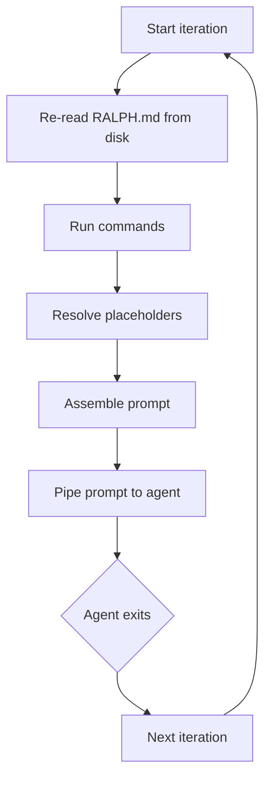

# How it works

This page explains what ralphify does under the hood during each iteration. Understanding the lifecycle helps you write better prompts, debug unexpected behavior, and make informed decisions about commands.

## The iteration lifecycle

Every iteration follows the same sequence:



Here's what happens at each step.

### 1. Re-read RALPH.md

The ralph file is read from disk **every iteration**. This means you can edit the prompt, add or remove commands, change the agent — all while the loop is running. Changes take effect on the next cycle.

### 2. Run commands

Each command defined in the `commands` frontmatter runs in order and captures its output (stdout + stderr). Commands run from the **project root** by default. Commands starting with `./` run relative to the **ralph directory** instead — useful for scripts bundled alongside your `RALPH.md`.

Command output is captured **regardless of exit code** — a command like `pytest -x` exits non-zero when tests fail, but its output is exactly what you want in the prompt.

Each command has a default timeout of 60 seconds. If a command takes longer, the process is killed and the output captured so far is used. Override this with the `timeout` field for slow commands (e.g., a large test suite):

```yaml
commands:
  - name: tests
    run: uv run pytest -x
    timeout: 300  # 5 minutes
```

### 3. Resolve placeholders

Each `{{ commands.<name> }}` placeholder in the prompt body is replaced with the corresponding command's output. Placeholders for `{{ args.<name> }}` are replaced with user argument values from the CLI — both in the prompt body and in command `run` strings.

Unmatched placeholders resolve to an empty string — you won't see raw `{{ }}` text in the assembled prompt.

### 4. Assemble the prompt

The prompt body (everything below the YAML frontmatter in `RALPH.md`) with all placeholders resolved becomes the fully assembled prompt — a single text string ready for the agent.

### 5. Pipe prompt to agent

The assembled prompt is piped to the agent command via stdin:

```
echo "<assembled prompt>" | claude -p --dangerously-skip-permissions
```

The agent reads the prompt, does work in the current directory (edits files, runs commands, makes commits), and exits. Ralphify waits for the agent process to finish.

When the agent command starts with `claude`, ralphify automatically adds `--output-format stream-json --verbose` to enable structured streaming. This lets ralphify track agent activity in real time — you don't need to configure this yourself.

### 6. Repeat

The loop starts the next iteration from step 1. The RALPH.md is re-read, commands run again with fresh output, and the agent gets a new prompt reflecting the current state of the codebase.

## What gets re-read each iteration

Everything is re-read from disk every iteration. There is no cached state between cycles.

| What | When read | Why it matters |
|---|---|---|
| `RALPH.md` | Every iteration | Edit the prompt while the loop runs — the next iteration follows your new instructions |
| Command output | Every iteration | The agent always sees fresh data (latest git log, current test status, etc.) |
| User arguments | Once at startup | Passed via CLI flags, constant for the run |

## How prompt assembly looks in practice

Here's a concrete example. Given this `RALPH.md`:

```markdown
---
agent: claude -p --dangerously-skip-permissions
commands:
  - name: git-log
    run: git log --oneline -5
  - name: tests
    run: uv run pytest -x
---

# Prompt

## Recent commits

{{ commands.git-log }}

## Test results

{{ commands.tests }}

Read TODO.md and implement the next task.
If tests are failing, fix them first.
```

### Iteration 1 (tests passing)

The assembled prompt piped to the agent:

```markdown
# Prompt

## Recent commits

a1b2c3d feat: add user model
e4f5g6h fix: resolve database connection timeout
i7j8k9l docs: update API reference

## Test results

============================= 5 passed in 1.23s ==============================

Read TODO.md and implement the next task.
If tests are failing, fix them first.
```

### Iteration 2 (tests broken by iteration 1)

```markdown
# Prompt

## Recent commits

x1y2z3a feat: add login endpoint
a1b2c3d feat: add user model
e4f5g6h fix: resolve database connection timeout

## Test results

FAILED tests/test_auth.py::test_login - AssertionError: expected 200, got 401
============================= 1 failed, 4 passed in 1.45s ====================

Read TODO.md and implement the next task.
If tests are failing, fix them first.
```

The agent sees the test failure and the instruction to fix it first. This is the **self-healing feedback loop**: the agent breaks something, the command captures the failure, and the agent sees it in the next iteration.

## Command execution order

Commands run in the order they appear in the `commands` list in the RALPH.md frontmatter. All commands run regardless of whether earlier commands fail.

```yaml
commands:
  - name: tests      # Runs first
    run: uv run pytest -x
  - name: lint       # Runs second
    run: uv run ruff check .
  - name: git-log    # Runs third
    run: git log --oneline -10
```

## Stop conditions

The loop continues until one of these happens:

| Condition | What happens |
|---|---|
| `Ctrl+C` | Loop stops after the current iteration finishes |
| `-n` limit reached | Loop stops after completing the specified number of iterations |
| `--stop-on-error` and agent exits non-zero | Loop stops immediately |
| `--timeout` exceeded | Agent process is killed, iteration is marked as timed out, loop continues (unless `--stop-on-error`) |

## Next steps

- [Getting Started](getting-started.md) — set up your first loop
- [Writing Prompts](writing-prompts.md) — patterns for effective autonomous loop prompts
- [CLI Reference](cli.md) — all commands and options
- [Troubleshooting](troubleshooting.md) — when things don't work as expected
