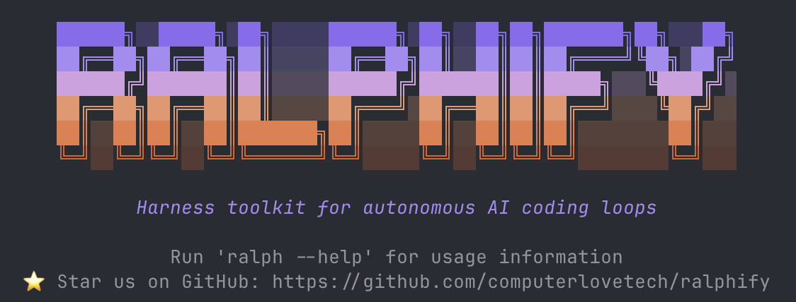

<p align="center">
  
</p>

<p align="center" style="font-size: 1.3em; margin-top: -0.5em;">
<strong>Put your AI coding agent in a <code>while True</code> loop and let it ship.</strong>
</p>

Ralphify is a minimal CLI harness for autonomous AI coding loops, inspired by the [Ralph Wiggum technique](https://ghuntley.com/ralph/). It pipes a prompt to an AI coding agent, validates the work with checks, and repeats — each iteration starts with a fresh context window.

[Get Started](getting-started.md){ .md-button .md-button--primary }
[View Cookbook](cookbook.md){ .md-button }

---

## Install

=== "uv (recommended)"

    ```bash
    uv tool install ralphify
    ```

=== "pipx"

    ```bash
    pipx install ralphify
    ```

=== "pip"

    ```bash
    pip install ralphify
    ```

## Two commands to start

```bash
ralph init      # Creates ralph.toml + RALPH.md
ralph run       # Starts the loop (Ctrl+C to stop)
```

`ralph init` creates a config file and a starter prompt. `ralph run` reads the prompt, pipes it to the agent, waits for it to finish, and does it again. Edit `RALPH.md` while the loop is running — changes take effect on the next iteration.

### What it looks like

```
$ ralph run -n 3 --log-dir ralph_logs

── Iteration 1 ──
✓ Iteration 1 completed (52.3s) → ralph_logs/001_20250115-142301.log
  Checks: 2 passed
    ✓ lint
    ✓ tests

── Iteration 2 ──
✗ Iteration 2 failed with exit code 1 (23.1s)
  Checks: 1 passed, 1 failed
    ✓ lint
    ✗ tests (exit 1)

── Iteration 3 ──
✓ Iteration 3 completed (41.7s) → ralph_logs/003_20250115-143012.log
  Checks: 2 passed
    ✓ lint
    ✓ tests

Done: 3 iteration(s) — 2 succeeded, 1 failed
```

Iteration 2 broke a test. Iteration 3 automatically received the failure output and fixed it — that's the self-healing loop in action.

---

## Three primitives

Ralphify extends the basic loop with three building blocks that live in the `.ralphify/` directory:

<div class="grid cards" markdown>

-   :material-check-circle-outline:{ .lg .middle } **Checks**

    ---

    Run after each iteration to validate the agent's work — tests, linters, type checks. Failed check output feeds into the next iteration so the agent can fix its own mistakes.

    [:octicons-arrow-right-24: Learn more](primitives.md#checks)

-   :material-database-outline:{ .lg .middle } **Contexts**

    ---

    Inject dynamic or static data into the prompt before each iteration — recent git history, current test status, reusable rules, or API responses. The agent always sees fresh information.

    [:octicons-arrow-right-24: Learn more](primitives.md#contexts)

-   :material-text-box-multiple-outline:{ .lg .middle } **Ralphs**

    ---

    Named, task-focused ralphs you can switch between without editing your root `RALPH.md`. Keep a `docs` ralph, a `refactor` ralph, and a `bug-fix` ralph — select the one you need at run time with `ralph run docs`.

    [:octicons-arrow-right-24: Learn more](primitives.md#ralphs)

</div>

---

## Requirements

- Python 3.11+
- [Claude Code CLI](https://docs.anthropic.com/en/docs/claude-code) (or [any agent CLI](agents.md) that accepts piped input)

---

## Next steps

- **[Getting Started](getting-started.md)** — from install to a running loop in 10 minutes
- **[Cookbook](cookbook.md)** — copy-pasteable setups for Python, TypeScript, bug fixing, and more
- **[Python API](api.md)** — embed the loop in your own automation
